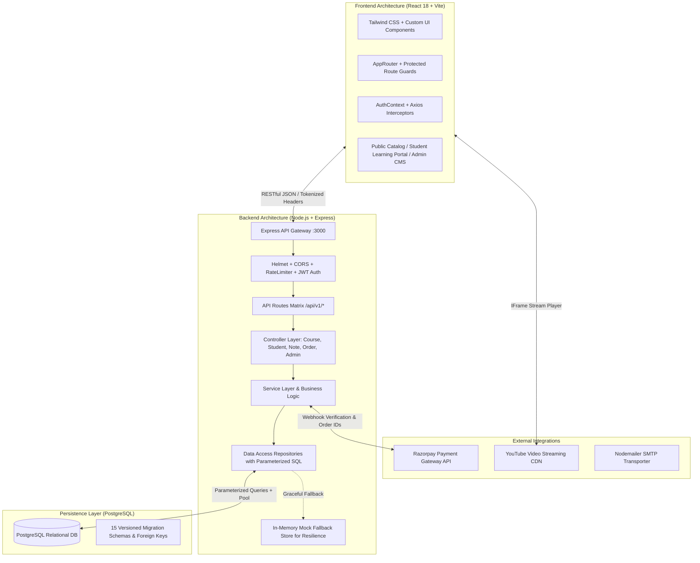

# Sidd Academy — System Architecture Documentation

## 1. High-Level Architectural Overview

Sidd Academy is engineered as a decoupled, multi-tiered full-stack educational platform with dedicated subsystems for public browsing, authenticated student learning, payment gateways, and content administration.

---

## 2. Core Subsystems

### 2.1 Public Catalog & Discovery Subsystem
- **Course & Batch Catalog**: Search, filter by class/subject/exam, view detailed curriculum outlines, and inspect sample video lectures.
- **Notes Store**: In-depth chapter summaries, sample preview pages, and pricing tags.
- **Dynamic Banners & Announcements**: Admin-managed promotional carousels highlighting new batches and discounts.

### 2.2 Student Learning & Progression Subsystem
- **Dashboard Telemetry**: Active courses, completed lecture counters, purchased notes library, and overall syllabus percentage meters.
- **Hierarchical Video Classroom**: `Course` → `Subject` → `Chapter` → `Lesson` tree navigation with YouTube HD player and tokenized chapter notes attachments.
- **Lesson Completion Engine**: Optimistic client updates with persistent server-side recording in `lesson_progress`.

### 2.3 Payment & Order Management Subsystem
- **Checkout Engine**: Unified order creation for both course enrollments and individual PDF note purchases.
- **Razorpay Gateway Integration**: HMAC-SHA256 signature verification, server-side status synchronization, and payment audit logs.
- **Immediate Resource Provisioning**: Automatic enrollment and digital note entitlement generation upon successful payment verification.

### 2.4 Administrative Content Management System (CMS)
- **Role-Based Access Control (RBAC)**: Strict API middleware checks (`authenticate` + `authorize('ADMIN')`).
- **Curriculum Hierarchy CRUD**: Interactive management for courses, subjects, chapters, and lessons.
- **Digital Asset Management**: PDF note uploads, price setting, publishing toggles, and tokenized download link distribution.
- **User & Order Oversight**: Student account status controls and transaction filtering.

---

## 3. Communication Protocols & Security Layers

| Layer | Implementation | Purpose |
|---|---|---|
| **Transport** | TLS / HTTPS + Express Reverse Proxy | Secure transport encryption across all endpoints |
| **Authentication** | JWT (Access + Refresh Tokens) + BCrypt | Stateless, secure user identification |
| **Authorization** | `authorize('ADMIN')` Middleware | Prevents privilege escalation on CMS routes |
| **Injection Defense**| Parameterized SQL (`$1, $2, ...`) | Prevents SQL injection across all database adapters |
| **Rate Limiting** | `express-rate-limit` | Mitigates brute-force authentication attempts |
| **XSS / Headers** | `helmet` + Strict Content Security | Sanitizes response headers and blocks clickjacking |
