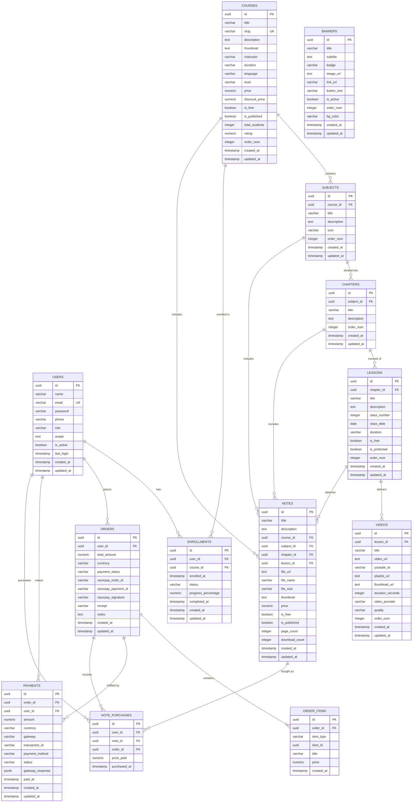

# Sidd Academy — PostgreSQL Database Specification & ER Diagram

This document provides the complete, normalized relational database specification, schema architecture, constraints, integrity rules, and Entity-Relationship (ER) diagram for the **Sidd Academy Online Coaching, Courses & Digital Notes Platform**.

---

## 1. Visual Entity-Relationship (ER) Diagram

---

## 2. Relational Schema Details & Normalization (3NF)

The database schema is designed adhering strictly to the **Third Normal Form (3NF)**:
1. **First Normal Form (1NF)**: All attributes are atomic (e.g., individual lessons, scalar prices, single contact emails) with unique Primary Keys.
2. **Second Normal Form (2NF)**: All non-key attributes are fully functionally dependent on the complete primary key (no partial dependencies on composite keys).
3. **Third Normal Form (3NF)**: No transitive dependencies exist. For example, order line items store unit price snapshots (`order_items.price`), while catalog master items remain in their respective source tables.

---

## 3. Table Catalog & Data Dictionary

### 3.1. `users` Table
Stores authentication credentials, user contact info, role-based access levels, and security flags.

| Column | Data Type | Constraints | Description |
|---|---|---|---|
| `id` | UUID | PRIMARY KEY, DEFAULT gen_random_uuid() | Unique User Identifier |
| `name` | VARCHAR(100) | NOT NULL | Full Name |
| `email` | VARCHAR(255) | NOT NULL, UNIQUE | Primary login email (lowercase indexed) |
| `password` | VARCHAR(255) | NOT NULL | Bcrypt hashed password |
| `phone` | VARCHAR(20) | NULL | Contact mobile number |
| `role` | VARCHAR(20) | NOT NULL, CHECK (role IN ('student', 'admin', 'user')), DEFAULT 'student' | Role-based authorization guard |
| `avatar` | TEXT | DEFAULT '' | Profile avatar URL |
| `is_active` | BOOLEAN | NOT NULL, DEFAULT true | Account status flag |
| `last_login` | TIMESTAMP WITH TIME ZONE | NULL | Timestamp of most recent authentication |
| `created_at` | TIMESTAMP WITH TIME ZONE | NOT NULL, DEFAULT CURRENT_TIMESTAMP | Record creation timestamp |
| `updated_at` | TIMESTAMP WITH TIME ZONE | NOT NULL, DEFAULT CURRENT_TIMESTAMP | Record modification timestamp |

---

### 3.2. `courses` Table
Stores master course records, syllabus metadata, pricing, publication status, and ratings.

| Column | Data Type | Constraints | Description |
|---|---|---|---|
| `id` | UUID | PRIMARY KEY, DEFAULT gen_random_uuid() | Unique Course Identifier |
| `title` | VARCHAR(200) | NOT NULL | Course Title |
| `slug` | VARCHAR(220) | NOT NULL, UNIQUE | URL-friendly unique slug |
| `description` | TEXT | NULL | In-depth course syllabus & prerequisites |
| `thumbnail` | TEXT | DEFAULT '' | Banner image URL |
| `instructor` | VARCHAR(100) | NOT NULL, DEFAULT 'Sidd Academy Faculty' | Lead Instructor Name |
| `duration` | VARCHAR(50) | DEFAULT '60+ Hours' | Estimated total program length |
| `language` | VARCHAR(50) | DEFAULT 'Hinglish' | Medium of instruction |
| `level` | VARCHAR(50) | CHECK (level IN ('Beginner', 'Intermediate', 'Advanced', 'All Levels')) | Target audience level |
| `price` | NUMERIC(10, 2) | NOT NULL, CHECK (price >= 0), DEFAULT 0.00 | Standard price in INR |
| `discount_price`| NUMERIC(10, 2) | CHECK (discount_price >= 0), DEFAULT 0.00 | Discounted / Sale price |
| `is_free` | BOOLEAN | NOT NULL, DEFAULT false | Flag for open free courses |
| `is_published` | BOOLEAN | NOT NULL, DEFAULT true | Visibility toggle |
| `total_students`| INTEGER | NOT NULL, CHECK (total_students >= 0), DEFAULT 0 | Active student count |
| `rating` | NUMERIC(3, 2) | CHECK (rating >= 0 AND rating <= 5.0), DEFAULT 4.90 | Star rating (0.0 to 5.0) |
| `order_num` | INTEGER | NOT NULL, DEFAULT 0 | Display sequence order |
| `created_at` | TIMESTAMP WITH TIME ZONE | NOT NULL, DEFAULT CURRENT_TIMESTAMP | Creation timestamp |
| `updated_at` | TIMESTAMP WITH TIME ZONE | NOT NULL, DEFAULT CURRENT_TIMESTAMP | Modification timestamp |

---

### 3.3. `subjects` Table
Represents modular subject domains within a Course (e.g., "PostgreSQL & Database Systems" inside "Full Stack Web Development").

| Column | Data Type | Constraints | Description |
|---|---|---|---|
| `id` | UUID | PRIMARY KEY, DEFAULT gen_random_uuid() | Unique Subject Identifier |
| `course_id` | UUID | NOT NULL, FOREIGN KEY REFERENCES courses(id) ON DELETE CASCADE | Parent Course Reference |
| `title` | VARCHAR(150) | NOT NULL | Subject Title |
| `description` | TEXT | NULL | Subject overview |
| `icon` | VARCHAR(100) | DEFAULT 'BookOpen' | UI Icon key |
| `order_num` | INTEGER | NOT NULL, DEFAULT 0 | Sort order index |
| `created_at` | TIMESTAMP WITH TIME ZONE | NOT NULL, DEFAULT CURRENT_TIMESTAMP | Creation timestamp |
| `updated_at` | TIMESTAMP WITH TIME ZONE | NOT NULL, DEFAULT CURRENT_TIMESTAMP | Modification timestamp |

---

### 3.4. `chapters` Table
Represents academic topic chapters under a Subject.

| Column | Data Type | Constraints | Description |
|---|---|---|---|
| `id` | UUID | PRIMARY KEY, DEFAULT gen_random_uuid() | Unique Chapter Identifier |
| `subject_id` | UUID | NOT NULL, FOREIGN KEY REFERENCES subjects(id) ON DELETE CASCADE | Parent Subject Reference |
| `title` | VARCHAR(150) | NOT NULL | Chapter Title |
| `description` | TEXT | NULL | Chapter summary |
| `order_num` | INTEGER | NOT NULL, DEFAULT 0 | Sort order index |
| `created_at` | TIMESTAMP WITH TIME ZONE | NOT NULL, DEFAULT CURRENT_TIMESTAMP | Creation timestamp |
| `updated_at` | TIMESTAMP WITH TIME ZONE | NOT NULL, DEFAULT CURRENT_TIMESTAMP | Modification timestamp |

---

### 3.5. `lessons` Table
Represents individual daily classes, live lectures, or scheduled classroom sessions.

| Column | Data Type | Constraints | Description |
|---|---|---|---|
| `id` | UUID | PRIMARY KEY, DEFAULT gen_random_uuid() | Unique Lesson Identifier |
| `chapter_id` | UUID | NOT NULL, FOREIGN KEY REFERENCES chapters(id) ON DELETE CASCADE | Parent Chapter Reference |
| `title` | VARCHAR(200) | NOT NULL | Lecture / Class Title |
| `description` | TEXT | NULL | Lesson notes summary |
| `class_number` | INTEGER | DEFAULT 1 | Sequential class index |
| `class_date` | DATE | DEFAULT CURRENT_DATE | Scheduled / Conducted date |
| `duration` | VARCHAR(50) | DEFAULT '45 mins' | Runtime string |
| `is_free` | BOOLEAN | NOT NULL, DEFAULT false | Accessible without enrollment |
| `is_protected` | BOOLEAN | NOT NULL, DEFAULT true | Requires authentication |
| `order_num` | INTEGER | NOT NULL, DEFAULT 0 | Sequence index |
| `created_at` | TIMESTAMP WITH TIME ZONE | NOT NULL, DEFAULT CURRENT_TIMESTAMP | Creation timestamp |
| `updated_at` | TIMESTAMP WITH TIME ZONE | NOT NULL, DEFAULT CURRENT_TIMESTAMP | Modification timestamp |

---

### 3.6. `videos` Table
Stores video streaming metadata, YouTube playlist references, or S3/cloud storage endpoints.

| Column | Data Type | Constraints | Description |
|---|---|---|---|
| `id` | UUID | PRIMARY KEY, DEFAULT gen_random_uuid() | Unique Video Identifier |
| `lesson_id` | UUID | NOT NULL, FOREIGN KEY REFERENCES lessons(id) ON DELETE CASCADE | Associated Lesson |
| `title` | VARCHAR(200) | NOT NULL | Video title |
| `video_url` | TEXT | NOT NULL | Stream URL / YouTube link |
| `youtube_id` | VARCHAR(100) | NULL | 11-char YouTube ID |
| `playlist_url` | TEXT | NULL | Optional YouTube playlist URL |
| `thumbnail_url`| TEXT | NULL | Thumbnail snapshot URL |
| `duration_seconds`| INTEGER | DEFAULT 0 | Exact duration in seconds |
| `video_provider`| VARCHAR(50) | CHECK (video_provider IN ('youtube', 'vimeo', 's3', 'local', 'custom')), DEFAULT 'youtube' | Stream provider |
| `quality` | VARCHAR(20) | DEFAULT '1080p' | Stream resolution |
| `order_num` | INTEGER | NOT NULL, DEFAULT 0 | Order position |
| `created_at` | TIMESTAMP WITH TIME ZONE | NOT NULL, DEFAULT CURRENT_TIMESTAMP | Creation timestamp |
| `updated_at` | TIMESTAMP WITH TIME ZONE | NOT NULL, DEFAULT CURRENT_TIMESTAMP | Modification timestamp |

---

### 3.7. `notes` Table
Stores digital PDFs, cheat sheets, handwritten study notes, and lecture presentations.

| Column | Data Type | Constraints | Description |
|---|---|---|---|
| `id` | UUID | PRIMARY KEY, DEFAULT gen_random_uuid() | Unique Note Identifier |
| `title` | VARCHAR(200) | NOT NULL | Note Title |
| `description` | TEXT | NULL | Detailed contents |
| `course_id` | UUID | NULL, FOREIGN KEY REFERENCES courses(id) ON DELETE SET NULL | Optional parent Course |
| `subject_id` | UUID | NULL, FOREIGN KEY REFERENCES subjects(id) ON DELETE SET NULL | Optional parent Subject |
| `chapter_id` | UUID | NULL, FOREIGN KEY REFERENCES chapters(id) ON DELETE SET NULL | Optional parent Chapter |
| `lesson_id` | UUID | NULL, FOREIGN KEY REFERENCES lessons(id) ON DELETE SET NULL | Optional parent Lesson |
| `file_url` | TEXT | NOT NULL | File storage endpoint |
| `file_name` | VARCHAR(255) | NOT NULL | Original filename |
| `file_size` | VARCHAR(50) | DEFAULT '2.5 MB' | Human readable file size |
| `thumbnail` | TEXT | DEFAULT '' | Document preview image |
| `price` | NUMERIC(10, 2) | NOT NULL, CHECK (price >= 0), DEFAULT 0.00 | Price if sold standalone |
| `is_free` | BOOLEAN | NOT NULL, DEFAULT false | Free download flag |
| `is_published` | BOOLEAN | NOT NULL, DEFAULT true | Public visibility |
| `page_count` | INTEGER | NOT NULL, CHECK (page_count > 0), DEFAULT 1 | Total pages in document |
| `download_count`| INTEGER | NOT NULL, CHECK (download_count >= 0), DEFAULT 0 | Metrics counter |
| `created_at` | TIMESTAMP WITH TIME ZONE | NOT NULL, DEFAULT CURRENT_TIMESTAMP | Creation timestamp |
| `updated_at` | TIMESTAMP WITH TIME ZONE | NOT NULL, DEFAULT CURRENT_TIMESTAMP | Modification timestamp |

---

### 3.8. `enrollments` Table
Many-to-Many relationship between Users and Courses, including completion tracking.

| Column | Data Type | Constraints | Description |
|---|---|---|---|
| `id` | UUID | PRIMARY KEY, DEFAULT gen_random_uuid() | Unique Enrollment ID |
| `user_id` | UUID | NOT NULL, FOREIGN KEY REFERENCES users(id) ON DELETE CASCADE | Student Reference |
| `course_id` | UUID | NOT NULL, FOREIGN KEY REFERENCES courses(id) ON DELETE CASCADE | Course Reference |
| `enrolled_at` | TIMESTAMP WITH TIME ZONE | NOT NULL, DEFAULT CURRENT_TIMESTAMP | Enrollment date |
| `status` | VARCHAR(20) | CHECK (status IN ('active', 'completed', 'cancelled', 'expired')), DEFAULT 'active' | Progress status |
| `progress_percentage`| NUMERIC(5, 2)| CHECK (progress_percentage >= 0 AND progress_percentage <= 100.0), DEFAULT 0.00 | Completed progress (0-100%) |
| `completed_at` | TIMESTAMP WITH TIME ZONE | NULL | Completion timestamp |
| `created_at` | TIMESTAMP WITH TIME ZONE | NOT NULL, DEFAULT CURRENT_TIMESTAMP | Creation timestamp |
| `updated_at` | TIMESTAMP WITH TIME ZONE | NOT NULL, DEFAULT CURRENT_TIMESTAMP | Modification timestamp |

**Unique Constraint**: `CONSTRAINT uq_user_course_enrollment UNIQUE (user_id, course_id)`

---

### 3.9. `orders` Table
Records checkout transactions, order sums, and payment gateway associations.

| Column | Data Type | Constraints | Description |
|---|---|---|---|
| `id` | UUID | PRIMARY KEY, DEFAULT gen_random_uuid() | Unique Order ID |
| `user_id` | UUID | NOT NULL, FOREIGN KEY REFERENCES users(id) ON DELETE CASCADE | Customer Reference |
| `total_amount` | NUMERIC(10, 2) | NOT NULL, CHECK (total_amount >= 0) | Total order sum |
| `currency` | VARCHAR(10) | NOT NULL, DEFAULT 'INR' | ISO Currency code |
| `payment_status`| VARCHAR(20) | CHECK (payment_status IN ('pending', 'paid', 'failed', 'refunded')), DEFAULT 'pending' | Current status |
| `razorpay_order_id`| VARCHAR(100)| NULL | Razorpay Order ID |
| `razorpay_payment_id`| VARCHAR(100)| NULL | Razorpay Payment ID |
| `razorpay_signature`| VARCHAR(255)| NULL | Cryptographic signature for audit |
| `receipt` | VARCHAR(100) | NULL | Invoice receipt number |
| `notes` | TEXT | NULL | Additional metadata notes |
| `created_at` | TIMESTAMP WITH TIME ZONE | NOT NULL, DEFAULT CURRENT_TIMESTAMP | Creation timestamp |
| `updated_at` | TIMESTAMP WITH TIME ZONE | NOT NULL, DEFAULT CURRENT_TIMESTAMP | Modification timestamp |

---

### 3.10. `order_items` Table
Itemized line entries for each purchase order.

| Column | Data Type | Constraints | Description |
|---|---|---|---|
| `id` | UUID | PRIMARY KEY, DEFAULT gen_random_uuid() | Unique Order Item ID |
| `order_id` | UUID | NOT NULL, FOREIGN KEY REFERENCES orders(id) ON DELETE CASCADE | Parent Order Reference |
| `item_type` | VARCHAR(20) | NOT NULL, CHECK (item_type IN ('course', 'note')) | Polymorphic Item Discriminator |
| `item_id` | UUID | NOT NULL | Target Course or Note ID |
| `title` | VARCHAR(200) | NOT NULL | Item title snapshot at purchase |
| `price` | NUMERIC(10, 2) | NOT NULL, CHECK (price >= 0) | Price charged per unit |
| `created_at` | TIMESTAMP WITH TIME ZONE | NOT NULL, DEFAULT CURRENT_TIMESTAMP | Creation timestamp |

---

### 3.11. `payments` Table
Transactional logs from payment gateways (Razorpay, UPI, Cards).

| Column | Data Type | Constraints | Description |
|---|---|---|---|
| `id` | UUID | PRIMARY KEY, DEFAULT gen_random_uuid() | Unique Payment ID |
| `order_id` | UUID | NOT NULL, FOREIGN KEY REFERENCES orders(id) ON DELETE CASCADE | Target Order Reference |
| `user_id` | UUID | NOT NULL, FOREIGN KEY REFERENCES users(id) ON DELETE CASCADE | Paying User |
| `amount` | NUMERIC(10, 2) | NOT NULL, CHECK (amount >= 0) | Amount captured |
| `currency` | VARCHAR(10) | NOT NULL, DEFAULT 'INR' | ISO Currency code |
| `gateway` | VARCHAR(50) | NOT NULL, DEFAULT 'razorpay' | Payment Provider |
| `transaction_id`| VARCHAR(150) | NOT NULL | Gateway transaction identifier |
| `payment_method`| VARCHAR(50) | DEFAULT 'upi' | Payment mode (upi, netbanking, card) |
| `status` | VARCHAR(20) | CHECK (status IN ('initiated', 'completed', 'failed', 'refunded')), DEFAULT 'completed' | Payment state |
| `gateway_response`| JSONB | NULL | Raw JSON payload from webhook |
| `paid_at` | TIMESTAMP WITH TIME ZONE | DEFAULT CURRENT_TIMESTAMP | Timestamp of successful capture |
| `created_at` | TIMESTAMP WITH TIME ZONE | NOT NULL, DEFAULT CURRENT_TIMESTAMP | Creation timestamp |
| `updated_at` | TIMESTAMP WITH TIME ZONE | NOT NULL, DEFAULT CURRENT_TIMESTAMP | Modification timestamp |

---

### 3.12. `note_purchases` Table
Join table granting students permanent entitlement to paid digital notes.

| Column | Data Type | Constraints | Description |
|---|---|---|---|
| `id` | UUID | PRIMARY KEY, DEFAULT gen_random_uuid() | Unique Purchase ID |
| `user_id` | UUID | NOT NULL, FOREIGN KEY REFERENCES users(id) ON DELETE CASCADE | Student Reference |
| `note_id` | UUID | NOT NULL, FOREIGN KEY REFERENCES notes(id) ON DELETE CASCADE | Purchased Note Reference |
| `order_id` | UUID | NULL, FOREIGN KEY REFERENCES orders(id) ON DELETE SET NULL | Associated Order |
| `price_paid` | NUMERIC(10, 2) | NOT NULL, CHECK (price_paid >= 0), DEFAULT 0.00 | Actual price paid |
| `purchased_at`| TIMESTAMP WITH TIME ZONE | NOT NULL, DEFAULT CURRENT_TIMESTAMP | Purchase timestamp |

**Unique Constraint**: `CONSTRAINT uq_user_note_purchase UNIQUE (user_id, note_id)`

---

### 3.13. `banners` Table
Promotional banners displayed on the student portal and home page carousels.

| Column | Data Type | Constraints | Description |
|---|---|---|---|
| `id` | UUID | PRIMARY KEY, DEFAULT gen_random_uuid() | Unique Banner ID |
| `title` | VARCHAR(200) | NOT NULL | Headline text |
| `subtitle` | TEXT | NULL | Secondary caption |
| `badge` | VARCHAR(50) | DEFAULT 'Featured' | Pill badge text |
| `image_url` | TEXT | NULL | Banner media URL |
| `link_url` | VARCHAR(255) | DEFAULT '/courses' | CTA route target |
| `button_text` | VARCHAR(50) | DEFAULT 'Explore Now' | Button CTA label |
| `is_active` | BOOLEAN | NOT NULL, DEFAULT true | Display toggle |
| `order_num` | INTEGER | NOT NULL, DEFAULT 0 | Carousel slide sequence |
| `bg_color` | VARCHAR(50) | DEFAULT 'from-indigo-900 to-purple-900' | Gradient theme CSS class |
| `created_at` | TIMESTAMP WITH TIME ZONE | NOT NULL, DEFAULT CURRENT_TIMESTAMP | Creation timestamp |
| `updated_at` | TIMESTAMP WITH TIME ZONE | NOT NULL, DEFAULT CURRENT_TIMESTAMP | Modification timestamp |
