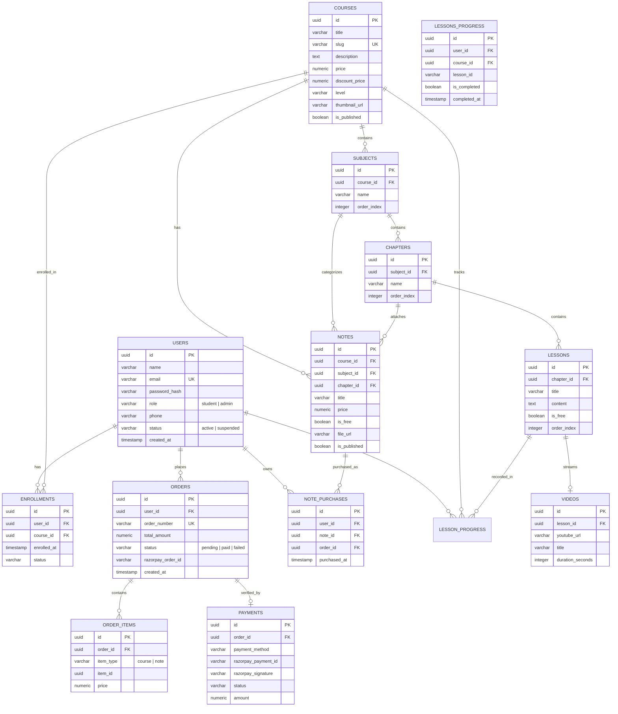

# Sidd Academy — Database Architecture & ER Diagram

## 1. Relational Schema Architecture

Sidd Academy's relational persistence engine is built on PostgreSQL with strict referential integrity, foreign key cascading constraints, unique constraints, and optimized b-tree indexing.

---

## 2. Migration Manifest

The database schema is defined across 15 incremental SQL migration files executed chronologically:

1. `001_create_users.sql` — User profiles, credentials, role-based definitions.
2. `002_create_courses.sql` — Master course definitions, pricing, slugs, and publishing states.
3. `003_create_subjects.sql` — Course subjects with foreign key relationships.
4. `004_create_chapters.sql` — Subject chapters with ordering indexes.
5. `005_create_lessons.sql` — Chapter lessons and preview visibility.
6. `006_create_videos.sql` — YouTube HD streams and lesson bindings.
7. `007_create_notes.sql` — Digital PDF study notes with pricing and chapter links.
8. `008_create_enrollments.sql` — Course access records and student enrollments.
9. `009_create_orders.sql` — Checkout transactions and gateway order numbers.
10. `010_create_order_items.sql` — Itemized order line items for courses & notes.
11. `011_create_payments.sql` — Razorpay payment verification references.
12. `012_create_note_purchases.sql` — Individual PDF entitlement tracking.
13. `013_create_banners.sql` — Homepage carousel announcements.
14. `014_orders_payments_v2.sql` — Enhanced indexes and audit timestamps.
15. `015_create_lesson_progress.sql` — Granular lesson completion tracking with unique `(user_id, course_id, lesson_id)` constraint.
